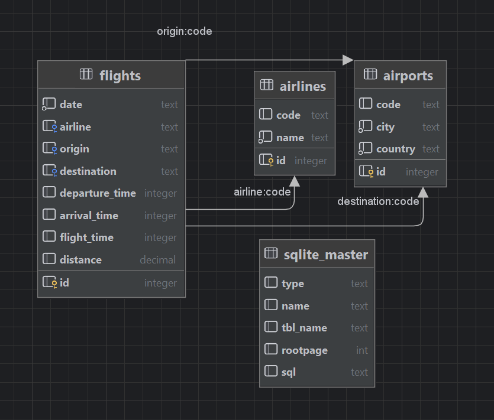
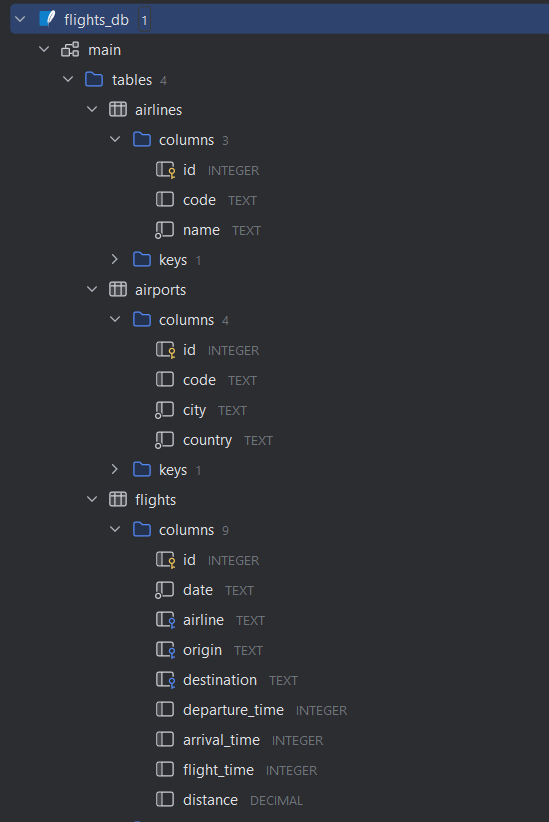

# Flight Database Management
*Lebiadzevich Artsem, 3 course, 12 group, 2023*

This project is a Python-based application for managing a SQLite database of flights, airlines, and airports. It allows you to create, read, update, and delete data from the database. The database consists of three tables: airports, airlines, and flights.

## Functionality
The Database class provides the following methods:

- **create_database**: creates the airports, airlines, and flights tables.
- **load_list_airports**, **load_list_airlines**, **load_list_flights**: load data from list into the respective tables.
- **load_csv_data**: loads data from CSV files into the respective tables.
- **get_flights_by_airline**, **get_flights_between_airports**: fetch flights based on airline code or origin and destination airports.
- **update_airports**, **update_airlines**, **update_flights**: update records in the respective tables.
- **delete_airports**, **delete_airlines**, **delete_flights**: delete records in the respective tables.

## Data
Data for airports and airlines is stored in values.py. The airport_values and airline_values variables contain data for 50 airports and airlines respectively. The flights_values variable contains randomly generated flight data. The actual data for airports, airlines, and flights is expected to be loaded from CSV files using the load_data method.

### Table `airports.csv`

| Field | Datatype |
|-------------|------------|
| `ID`  | INT |
| `Code`  | TEXT       |
| `City` | TEXT       | 
| `Country`   | TEXT       |

### Table `airlines.csv`

| Field | Datatype |
|-------------|------------|
| `ID`  | INT |
| `Code`  | TEXT       |
| `Name` | TEXT       | 

### Table `flights.csv`

| Field | Datatype |
|-------------|------------|
| `ID`  | INT |
| `Date`  | DATE |
| `Airline` | TEXT       | 
| `Origin`   | TEXT       |
| `Destination`  | TEXT       |
| `Departure_time`  | INT |
| `Arrival_time ` | INT | 
| `Flight_time `   | INT |
| `Distance `   | DECIMAL |


The "airline", "origin" and "destination" fields in the flights table use values from the airline and airport lookups. This shows the dependency of one table on others. The lookups contain all the necessary data types: text, date, numeric (integers).

## Schema



## Installation and Use
1. Ensure Python 3.8 or later is installed on your system.

2. Clone this repository to your local machine.

3. Install the required packages listed in requirements.txt using pip:

```bash
pip install -r requirements.txt
```
4. Run main.py to use the application. Note that running main.py will:

5. Create a SQLite database called flights_db.sqlite if it does not exist.
6. Create tables and insert some records.
7. Update some records.
8. Run unit tests.
9. Finally, delete all the inserted records.


## Testing
Unit tests are included in the test.py file. They test the functions of getting flights by airline code, getting flights between two airports, updating flight information, and deleting a flight.

## Notes
- The load_data function expects the CSV files to be in the same directory as the script. The names of the files are airports.csv, airlines.csv, and flights.csv.
- The data in the CSV files should have the same structure as the data in the values.py file.
- The load_data function will append the data from the CSV files to the existing data in the tables.
- The delete functions take a range of IDs to delete. Be careful with these functions as they will permanently delete data from the database.
